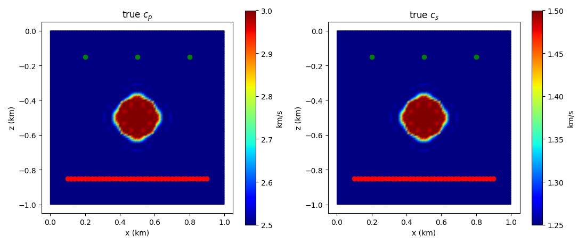
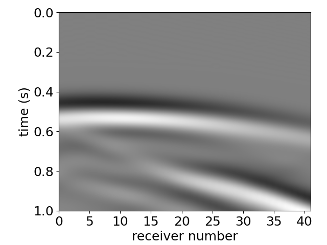
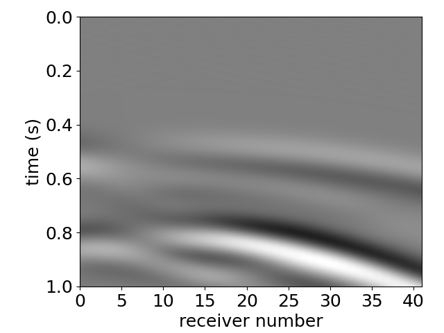
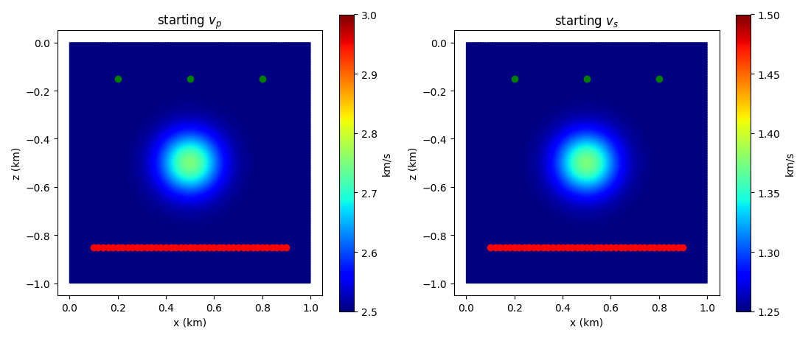
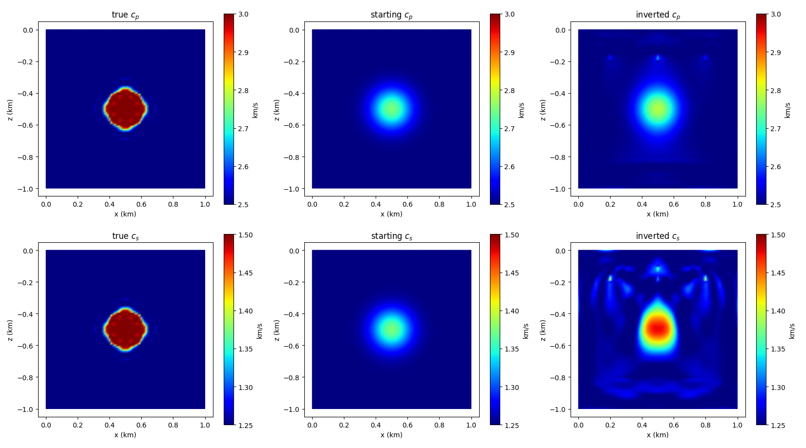
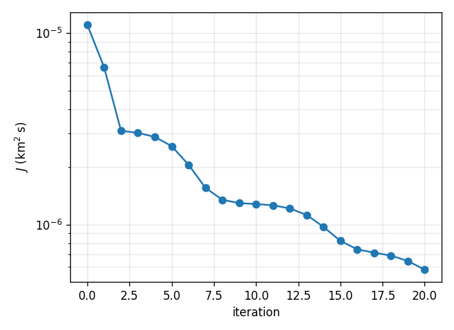

Elastic full waveform inversion with the automated adjoint
==========================================================

This demo uses spyro to recover the P- and S-wave velocities of a circular
inclusion in a two-dimensional elastic medium. Density stays fixed. We
first generate synthetic observations, choose a starting model, check the
adjoint gradient, and then run the inversion.

`Daiane I Dolci <https://ig-dolci.github.io/>`__ prepared this tutorial.

Running the demo
--------------------

We recommend the latest Firedrake release to run this demo. From this
demo's directory, extract the Python code with
`pylit <https://pypi.org/project/pylit/>`__ and run three shots on three
MPI processes::

    pylit --code-block-marker ".. code-block:: python" elastic_fwi_automated_adjoint.py.rst
    mpiexec -n 3 python elastic_fwi_automated_adjoint.py

The ``.. code-block:: python`` blocks below form the complete program, in
order. The run saves model plots, shot records as figures, and inversion
outputs in the current directory.

Full Waveform Inversion (FWI)
-----------------------------

FWI seeks to adjust material parameters to reduce the misfit between
predicted and observed receiver data [Tarantola1984]_,
[Virieux2009]_. Here the controls are :math:`m = (c_p, c_s)`, and the misfit is

.. math::

    J(m) = \frac{1}{2} \sum_{s=1}^{N_s} \sum_{r=1}^{N_r} \int_0^T
    \left\| \mathbf{u}_s(m, \mathbf{x}_r, t)
    - \mathbf{d}_s(\mathbf{x}_r, t) \right\|^2 \, dt.

For each shot :math:`s`, :math:`\mathbf{u}_s` is the predicted displacement
and :math:`\mathbf{d}_s` is the observation at receiver :math:`\mathbf{x}_r`.
The norm includes both displacement components. spyro approximates the time
integral with the trapezoidal rule on the solver's time grid.

In this synthetic example, the observations come from a forward solve with
a known *true model*. The inversion begins from a different *starting
model*.

The forward model
---------------------

The displacement of an isotropic elastic solid satisfies

.. math::

    \rho \, \partial_{tt}\mathbf{u}
    - \nabla \cdot \boldsymbol{\sigma}(\mathbf{u}) = \mathbf{f},
    \qquad
    \boldsymbol{\sigma}(\mathbf{u}) =
    \lambda (\nabla \cdot \mathbf{u})\mathbf{I}
    + 2\mu\boldsymbol{\varepsilon}(\mathbf{u}),

where :math:`\rho` is density, :math:`\mathbf{f}` is the source force, and
:math:`\boldsymbol{\varepsilon}(\mathbf{u}) =
(\nabla\mathbf{u} + \nabla\mathbf{u}^{T})/2` is strain. spyro derives the
Lamé parameters from the P- and S-wave speeds:

.. math::

    \mu = \rho c_s^2, \qquad \lambda = \rho(c_p^2 - 2c_s^2).

The medium starts at rest and is excited by vertical point forces with a
5 Hz Ricker wavelet [Ricker1953]_. We use degree-4 spectral elements on
quadrilaterals [Komatitsch1998]_ and central differences in time. Stacey
absorbing conditions [Stacey1988]_ reduce reflections at all four edges;
there is no free surface. Sources and receivers lie on opposite sides of
the inclusion, forming a transmission experiment.

Automated Adjoints
------------------

``firedrake.adjoint`` records the forward computation on a *tape* and
traverses it backwards to differentiate the discrete misfit. A *reduced
functional* wraps that computation so the optimiser can evaluate the misfit
and its gradient at new control values.

The demo uses ``SingleMemoryStorageSchedule``: all states needed by the
adjoint stay in memory, with no forward recomputation. For larger problems,
setting ``snapshots`` enables a schedule that stores fewer checkpoints and
recomputes intermediate states, the mixed checkpointing strategy of
[Maddison2024]_.

With ``"parallelism": {"type": "automatic"}``, each ensemble member handles
one shot. ``EnsembleReducedFunctional`` sums their misfits and gradients.
Three MPI processes give one process per shot; six give two processes per
shot to share its mesh. Use a multiple of three processes. See the
`Firedrake FWI tutorial
<https://www.firedrakeproject.org/demos/full_waveform_inversion.py.html>`__
for details of ensemble parallelism.

Setting up the problem
--------------------------

We use ``ElasticMaterialParameter`` to name the controls and ``AdjointType``
to select the automated adjoint. Matplotlib's ``Agg`` backend saves figures
without opening a window.

.. code-block:: python

    import numpy as np
    import firedrake as fire
    import matplotlib
    matplotlib.use("Agg")
    import matplotlib.pyplot as plt

    import spyro
    from spyro.domains.space import create_function_space
    from spyro.io.basicio import parallel_print
    from spyro.utils.typing import AdjointType

    Parameter = spyro.ElasticMaterialParameter

Lengths are in km, times in s, and velocities in km/s. With density in
g/cm³, the Lamé parameters :math:`\rho c^2` are in GPa. The inclusion has
higher P- and S-wave velocities than the background:

.. code-block:: python

    rho = 2.0              # density, g/cm^3 (the same everywhere)
    cp_background = 2.5    # P-wave velocity, km/s
    cs_background = 1.25   # S-wave velocity, km/s
    cp_circle = 3.0        # km/s
    cs_circle = 1.5        # km/s

    center_z, center_x = -0.5, 0.5   # centre of the circle, km
    radius = 0.125                   # km

The domain is a 1 km × 1 km square. spyro's first coordinate is the depth
:math:`z`, which is zero at the top and *negative* below it, and the second
is the horizontal position :math:`x`. The mesh is a uniform grid of
quadrilaterals of 100 m (``edge_length``), and the Ricker wavelet has a peak
frequency of 5 Hz. The time step of 1.6 ms is close to the stability limit
of this mesh for the fastest velocity the inversion is allowed to reach,
and the records are 1 s long: enough for the P wave, which arrives from
about 0.5 s, and the slower S wave, from about 0.8 s.

.. code-block:: python

    length_z = 1.0   # depth of the domain, km
    length_x = 1.0   # width of the domain, km

    edge_length = 0.1     # element size, km
    dt = 0.0016           # time step, s
    maxiter = 20          # optimiser iterations

    final_time = 1.0      # length of the records, s
    frequency = 5.0       # peak frequency of the Ricker wavelet, Hz
    number_of_shots = 3

The configuration selects degree-4 mass-lumped quadrilaterals in two
dimensions and automatic shot parallelism.

.. code-block:: python

    dictionary = {}
    dictionary["options"] = {
        "cell_type": "Q",
        "variant": "lumped",
        "degree": 4,
        "dimension": 2,
    }
    dictionary["parallelism"] = {
        "type": "automatic",
    }
    dictionary["mesh"] = {
        "length_z": length_z,
        "length_x": length_x,
        "length_y": 0.0,
        "mesh_file": None,
        "mesh_type": "firedrake_mesh",
    }

The three sources are at :math:`z = -0.15` km, at :math:`x = 0.2`, 0.5
and 0.8 km; the 41 receivers are on the line :math:`z = -0.85` km, from
:math:`x = 0.1` to 0.9 km.

.. code-block:: python

    dictionary["acquisition"] = {
        "source_type": "ricker",
        "source_locations": spyro.create_transect(
            (-0.15, 0.2), (-0.15, 0.8), number_of_shots,
        ),
        "frequency": frequency,
        "amplitude": np.array([1.0, 0.0]),   # vertical unit force (z, x)
        "receiver_locations": spyro.create_transect(
            (-0.85, 0.1), (-0.85, 0.9), 41,
        ),
    }

``synthetic_data`` supplies the background material. spyro computes
:math:`\lambda` and :math:`\mu` from these values. The true and starting
velocity models are shown below.

.. code-block:: python

    dictionary["synthetic_data"] = {
        "type": "object",
        "density": rho,
        "p_wave_velocity": cp_background,
        "s_wave_velocity": cs_background,
        "real_velocity_file": None,
    }

Next come the absorbing boundary condition, the time axis and the outputs.
``output_frequency`` only controls how often progress is printed, since the
wavefield output is switched off.

.. code-block:: python

    dictionary["absorving_boundary_conditions"] = {
        "status": True,
        "abc_type": "nrbc",
        "nrbc": {"type": "Stacey", "dt_scheme": "backward"},
    }
    dictionary["time_axis"] = {
        "initial_time": 0.0,
        "final_time": final_time,
        "dt": dt,
        "output_frequency": 100,
        "gradient_sampling_frequency": 1,
    }
    dictionary["visualization"] = {
        "forward_output": False,
        "gradient_output": False,
        "adjoint_output": False,
        "debug_output": False,
    }

``FullWaveformInversion`` manages the inversion; ``wave_class`` selects the
elastic solver, available as ``fwi.wave``. Its communicator ``fwi.comm`` has
a spatial communicator (``comm``) and one connecting shots
(``ensemble_comm``).

.. code-block:: python

    fwi = spyro.FullWaveformInversion(
        dictionary=dictionary, wave_class=spyro.IsotropicWave,
    )
    comm = fwi.comm
    parallel_print(
        f"{comm.ensemble_comm.size} ensemble member(s), "
        f"{comm.comm.size} process(es) each", comm,
    )

The true model and the observed data
----------------------------------------

``set_real_mesh`` builds the mesh for generating observations. A smoothed
indicator, close to one inside the circle and zero outside, defines the
velocity anomalies. The hyperbolic tangent smooths their edges.

.. code-block:: python

    fwi.set_real_mesh(input_mesh_parameters={"edge_length": edge_length})

    z, x = fwi.wave.mesh_z, fwi.wave.mesh_x
    distance = fire.sqrt((z - center_z) ** 2 + (x - center_x) ** 2)
    inside = 0.5 * (1.0 + fire.tanh(200.0 * (radius - distance)))
    cp_true = cp_background + (cp_circle - cp_background) * inside
    cs_true = cs_background + (cs_circle - cs_background) * inside

Pass the three true material fields to ``set_real_model``:

.. code-block:: python

    fwi.set_real_model({
        Parameter.DENSITY: rho,
        Parameter.P_WAVE_VELOCITY: cp_true,
        Parameter.S_WAVE_VELOCITY: cs_true,
    })

``generate_real_shot_record`` propagates the shots through the true model
and stores the observed displacements in ``fwi.real_shot_record``. Each
ensemble member holds its own shot.

.. code-block:: python

    fwi.generate_real_shot_record(save_shot_record=False)

Plot the true velocities with the sources and receivers overlaid:

.. code-block:: python

    material_space = create_function_space(
        fwi.wave.mesh, fwi.wave.method, fwi.wave.degree, dim=1,
    )
    cp_true_field = fire.Function(material_space).interpolate(cp_true)
    cs_true_field = fire.Function(material_space).interpolate(cs_true)

    sources = dictionary["acquisition"]["source_locations"]
    receivers = dictionary["acquisition"]["receiver_locations"]
    first_member = comm.ensemble_comm.rank == 0

    if first_member:
        spyro.plots.plot_scalar_field(
            [cp_true_field, cs_true_field], "elastic_fwi_true_model.png",
            titles=["true $c_p$", "true $c_s$"],
            vmin=[cp_background, cs_background], vmax=[cp_circle, cs_circle],
            colorbar_label="km/s", cmap="jet",
            sources=sources, receivers=receivers,
        )

``plot_shots`` reads ``forward_solution_receivers``, so copy the observed
record there before plotting its vertical and horizontal components.

.. code-block:: python

    fwi.wave.forward_solution_receivers = fwi.real_shot_record
    for component, name in enumerate(("uz", "ux")):
        spyro.plots.plot_shots(
            fwi.wave, filename=f"elastic_fwi_observed_{name}",
            out_index=component, file_format="png",
        )

The P wave dominates the vertical component and arrives first; the S wave,
slower and stronger on the horizontal component, follows about 0.3 s later.
Both carry the imprint of the circle to the receivers.

The starting model and the controls
---------------------------------------

For the sake of simplicity, the inversion runs on the *guess* mesh with
the same element size as the mesh on which the observed data were
generated.

.. code-block:: python

    fwi.set_guess_mesh(input_mesh_parameters={"edge_length": edge_length})

The starting model is a smooth Gaussian anomaly at the same centre, with
half the contrast of the circle. ``set_guess_control`` sets the two
velocities; density remains fixed. We also record the starting velocities
at the centre for comparison.

.. code-block:: python

    z, x = fwi.wave.mesh_z, fwi.wave.mesh_x
    distance = fire.sqrt((z - center_z) ** 2 + (x - center_x) ** 2)
    gaussian = fire.exp(-(distance / radius) ** 2)
    cp_start = cp_background + 0.5 * (cp_circle - cp_background) * gaussian
    cs_start = cs_background + 0.5 * (cs_circle - cs_background) * gaussian
    fwi.set_guess_control({
        Parameter.P_WAVE_VELOCITY: cp_start,
        Parameter.S_WAVE_VELOCITY: cs_start,
    })
    at_center = fire.PointEvaluator(fwi.wave.mesh, [(center_z, center_x)])
    cp_start_center = float(at_center.evaluate(fwi.wave.c)[0])
    cs_start_center = float(at_center.evaluate(fwi.wave.c_s)[0])

    if first_member:
        spyro.plots.plot_scalar_field(
            [fwi.wave.c, fwi.wave.c_s], "elastic_fwi_starting_model.png",
            titles=["starting $c_p$", "starting $c_s$"],
            vmin=[cp_background, cs_background], vmax=[cp_circle, cs_circle],
            colorbar_label="km/s", cmap="jet",
            sources=sources, receivers=receivers,
        )

Enable the automated adjoint for the two velocity fields. Selecting these
*controls* leaves density fixed. ``checkpointing=True`` uses a single
memory schedule that does not recompute the forward solve and stores only
the forward data used for the adjoint-based gradient. Periodic garbage
collection (``gc_timestep_frequency``) releases reference cycles, a good
approach when the code that obtains the automated gradient is prone to
them.

.. code-block:: python

    control_parameters = {
        Parameter.P_WAVE_VELOCITY,
        Parameter.S_WAVE_VELOCITY,
    }
    fwi.wave.enable_automated_adjoint(
        control_parameters=control_parameters,
        checkpointing=True, gc_timestep_frequency=50,
    )

Gradient verification
-------------------------

Record a forward solve at the starting model, then compute its gradient.
``gradient_solve`` returns one field per control, keyed by material parameter.

.. code-block:: python

    fwi.wave.forward_solve()
    gradient = fwi.wave.gradient_solve()
    parallel_print(
        f"Gradient computed for {[parameter.value for parameter in gradient]}",
        comm,
    )

A Taylor test checks whether this gradient predicts the change in misfit
under a small perturbation :math:`h\delta m`. For a correct derivative,

.. math::

    \left|J(m+h\delta m)-J(m)-h\,DJ(m)[\delta m]\right| = O(h^2).

Thus, halving :math:`h` should reduce the residual by about four, until
round-off dominates. ``verify_gradient`` pairs the gradient fields with the
perturbations and returns the observed convergence rate, which should be
close to two. We use the same random seed on every ensemble member so their
perturbations agree.

.. code-block:: python

    controls = fwi.wave.automated_adjoint.controls
    rng = np.random.default_rng(42)
    directions = [
        fire.Function(
            control.function_space(),
            val=0.05 * control.dat.data_ro * rng.random(control.dat.data_ro.shape),
        )
        for control in controls
    ]
    rate = fwi.wave.automated_adjoint.verify_gradient(
        controls, direction=directions, dJdm=gradient,
    )
    parallel_print(
        f"Taylor test: the residual falls at rate {rate:.3f} (2 expected)",
        comm,
    )

Running the inversion
-------------------------

Give each velocity its own bounds, in control order: :math:`c_p`, then
:math:`c_s`. These bounds keep both speeds positive and ensure
:math:`c_p/c_s \geq 2.3/1.6 > \sqrt{2}`, so :math:`\lambda > 0`.
If you change the bounds or mesh, also check the time-step stability using
the largest allowed P-wave speed, rather than just the starting velocity.

.. code-block:: python

    cp_bounds = (2.3, 3.5)   # km/s
    cs_bounds = (1.0, 1.6)   # km/s

Large gradients near sources and receivers can dominate model updates
[Modrak2016]_. A common practice in this case is to zero out such regions.
This binary mask allows updates only in the strip :math:`-0.75 < z < -0.3`
km, holding the starting model fixed elsewhere.

.. code-block:: python

    gradient_mask = fire.conditional(fire.And(z < -0.3, z > -0.75), 1.0, 0.0)

``run_fwi`` records the starting forward solve and passes its reduced
functional to PETSc/TAO's bound-constrained quasi-Newton method, BLMVM
[Benson2001]_. spyro uses a lumped mass metric and applies the gradient mask
at each evaluation. ``maxiter`` is an upper limit of 20 iterations; TAO can
stop earlier. If it reaches the limit, the driver warns and returns the
last iterate.

.. code-block:: python

    controls = fwi.run_fwi(
        adjoint_type=AdjointType.AUTOMATED_ADJOINT,
        vmin=[cp_bounds[0], cs_bounds[0]],
        vmax=[cp_bounds[1], cs_bounds[1]],
        maxiter=maxiter,
        gradient_mask=gradient_mask,
    )

The result contains one ``Function`` per control, in the order of the
bounds. ``functional_history`` includes the starting misfit and accepted
iterations. The driver also writes ``control_<iteration>.pvd``,
``control_end.pvd`` and ``functional_values.txt``; open the ``.pvd`` files
in ParaView.

.. code-block:: python

    cp_result, cs_result = controls
    parallel_print(
        f"Controls: {[control.name() for control in controls]}", comm,
    )
    parallel_print(f"Functional history: {fwi.functional_history}", comm)

Results
-----------

Compare the recovered velocities at the centre with their starting and
true values. This is one local measure of recovery; the maps below show
what happened throughout the domain.

.. code-block:: python

    cp_center = float(at_center.evaluate(cp_result)[0])
    cs_center = float(at_center.evaluate(cs_result)[0])
    parallel_print(
        f"At the centre of the circle: c_p = {cp_center:.3f} km/s "
        f"(started at {cp_start_center:.3f}, true {cp_circle}), "
        f"c_s = {cs_center:.3f} km/s "
        f"(started at {cs_start_center:.3f}, true {cs_circle})", comm,
    )

Plot the true, starting and inverted models on a common colour scale for
each velocity. The misfit history shows how much the fit to the data improved.

.. code-block:: python

    if first_member:
        space = cp_result.function_space()
        cp_start_field = fire.Function(space).interpolate(cp_start)
        cs_start_field = fire.Function(space).interpolate(cs_start)
        spyro.plots.plot_scalar_field(
            [cp_true_field, cp_start_field, cp_result,
             cs_true_field, cs_start_field, cs_result],
            "elastic_fwi_models.png", columns=3,
            titles=["true $c_p$", "starting $c_p$", "inverted $c_p$",
                    "true $c_s$", "starting $c_s$", "inverted $c_s$"],
            vmin=[cp_background] * 3 + [cs_background] * 3,
            vmax=[cp_circle] * 3 + [cs_circle] * 3,
            colorbar_label="km/s", cmap="jet",
        )

    if first_member and comm.comm.rank == 0:
        figure, axes = plt.subplots(figsize=(5.5, 4))
        axes.semilogy(fwi.functional_history, "o-")
        axes.set_xlabel("iteration")
        axes.set_ylabel("$J$ (km$^2$ s)")
        axes.grid(True, which="both", alpha=0.3)
        figure.tight_layout()
        figure.savefig("elastic_fwi_functional_history.png", dpi=120)

After 20 iterations the misfit has fallen by a factor of about 19. The
S-wave velocity has become a circle of the right size and amplitude, about
1.52 km/s at the centre against a true 1.5, while the P-wave velocity has
moved much less, from 2.75 to about 2.82 km/s against 3.0.

A decreasing misfit means the predicted records better match the
observations. We can achieve a better predicted model via FWI using more
iterations, or other strategies for multiparameter inversion problems. It
is an exercise for you!

.. admonition:: Exercise: invert one velocity at a time

    Rerun the script from the same starting model, replacing
    ``maxiter=maxiter`` in ``run_fwi`` with::

        stages=[
            (Parameter.S_WAVE_VELOCITY, 10),
            (Parameter.P_WAVE_VELOCITY, 10),
        ],

    The first stage updates only :math:`c_s`; the second updates only
    :math:`c_p`, keeping the first stage's :math:`c_s`. Both use the same
    tape and spatial mask. Compare the final misfit and both recovered
    models with the joint inversion. Does changing the stage order help?

.. note::

    This example uses noiseless data, the same mesh for data generation and
    inversion, and a starting anomaly at the correct location. It illustrates
    the workflow under favourable conditions. Field-data FWI also needs to
    address noise, modelling errors, regularisation and starting-model quality.

.. rubric:: References

.. [Benson2001] Benson, S. J., & Moré, J. J. (2001). A limited memory
    variable metric method in subspaces and bound constrained optimization
    problems. Technical Report ANL/MCS-P909-0901, Argonne National
    Laboratory.

.. [Komatitsch1998] Komatitsch, D., & Vilotte, J.-P. (1998). The spectral
    element method: an efficient tool to simulate the seismic response of 2D
    and 3D geological structures. Bulletin of the Seismological Society of
    America, 88(2), 368–392.

.. [Maddison2024] Maddison, J. R. (2024). Step-based checkpointing with
    high-level algorithmic differentiation. Journal of Computational
    Science, 82, 102405.

.. [Modrak2016] Modrak, R., & Tromp, J. (2016). Seismic waveform inversion
    best practices: regional, global and exploration test cases.
    Geophysical Journal International, 206(3), 1864–1889.

.. [Ricker1953] Ricker, N. (1953). The form and laws of propagation of
    seismic wavelets. Geophysics, 18(1), 10–40.

.. [Stacey1988] Stacey, R. (1988). Improved transparent boundary
    formulations for the elastic-wave equation. Bulletin of the Seismological
    Society of America, 78(6), 2089–2097.

.. [Tarantola1984] Tarantola, A. (1984). Inversion of seismic reflection
    data in the acoustic approximation. Geophysics, 49(8), 1259–1266.

.. [Virieux2009] Virieux, J., & Operto, S. (2009). An overview of
    full-waveform inversion in exploration geophysics. Geophysics, 74(6),
    WCC1–WCC26.
